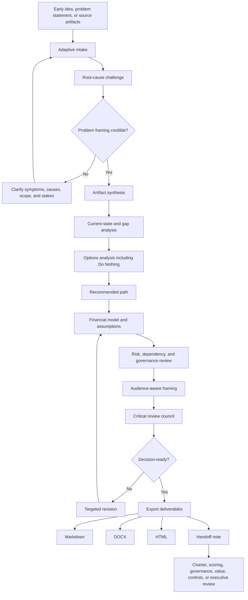

# Business Case System

A structured, AI-assisted business case development system for turning rough ideas and source artifacts into decision-ready business cases.

Business Case System helps users interview an idea, challenge weak or solution-first problem framing, test root-cause assumptions, evaluate real options, build a defensible financial case, surface material risks, apply audience-aware review, and generate polished outputs in Markdown, DOCX, or HTML.

It is not a substitute for business judgment, sponsor accountability, financial scrutiny, or governance discipline. It is a structured operating workflow for applying those disciplines before a business case reaches an executive sponsor, CFO, approval body, or governance forum.

## Status

Public portfolio prototype. Designed for ChatGPT Project use, executive review, and workflow demonstration. Not a SaaS product, autonomous investment engine, or substitute for sponsor, finance, and governance approval.

## How to evaluate this repo

Open these first:

- [`chatgpt-project/`](chatgpt-project/) for the flat ChatGPT runtime.
- [`examples/sample-data/`](examples/sample-data/) for the fictional input scenario.
- [`examples/sample-outputs/`](examples/sample-outputs/) for Markdown, HTML, DOCX, and quality-review outputs.
- [`quality-review/`](quality-review/) for package review notes.

Evaluate the repo on whether it strengthens weak problem framing, separates symptoms from root causes, includes a real Do Nothing option, exposes assumptions, and keeps final approval human-owned.

For local maintenance, compare value language against
[`../roi-business-value-anti-patterns.md`](../roi-business-value-anti-patterns.md)
so false precision, unsupported savings, proxy confusion, and completion-as-value
do not creep into examples.

## Before and after example

Before: a sponsor or team has a rough idea, scattered notes, and a preferred solution, but the root cause, options, financial assumptions, risks, and decision audience are not yet clear.

After: the idea becomes a decision-ready business case with problem framing, current-state evidence, options analysis, recommended path, financial assumptions, risks, dependencies, implementation approach, and explicit review limits.

## Who this is for

- Business owners shaping an investment request
- Knowledge workers turning messy notes into a decision document
- Managers and senior leaders preparing an approval case
- Software, engineering, operations, and delivery teams proposing change
- Portfolio, PMO, strategy, and operations teams supporting governance review

## What it does

- Runs adaptive intake instead of a static questionnaire
- Distinguishes symptoms from root causes before drafting
- Ingests notes, spreadsheets, project plans, CSVs, Word documents, and source artifacts
- Evaluates options, including a genuine Do Nothing option
- Builds a financial view with hard/soft benefit separation and assumptions
- Names risks, dependencies, constraints, owners, and residual exposure
- Applies audience-aware framing for finance, executive, operational, and technical reviewers
- Produces Markdown, DOCX, and HTML outputs
- Preserves human control over claims, decisions, and final approval

## Module boundary

| Boundary question | Answer |
|---|---|
| This module starts when | A concept, problem, request, source-artifact set, or investment idea needs defensible business-case logic. |
| This module ends when | A decision-ready business case, assumptions list, risk view, and downstream handoff note are ready for human review. |
| This module produces | Business case, options analysis, financial assumptions, risk/dependency view, recommendation, review findings, and handoff note. |
| This module hands off to | Project Charter Initiation Agent, Portfolio Prioritization Scoring Agent, PMO Governance Operations Log, Value Realization Governance Ledger, Controls Exposure Governance Toolkit, or Executive Portfolio Review Pack Builder. |
| This module does not | Approve funding, authorize projects, create full charters, score portfolio priority, track benefits, run governance meetings, or accept risk. |

## Adjacent module fit

| Need | Better destination |
|---|---|
| Approved intent needs scope, sponsors, governance rhythm, and execution guardrails | Project Charter Initiation Agent |
| Several initiatives need comparative weighting or tradeoff review | Portfolio Prioritization Scoring Agent |
| Actions, risks, decisions, or blockers need recurring follow-through | PMO Governance Operations Log |
| Approved benefits need measurement and evidence tracking | Value Realization Governance Ledger |
| Material control, supplier, audit, compliance, financial, or operational exposure appears | Controls Exposure Governance Toolkit |
| Sponsor or executive review needs a broader decision pack | Executive Portfolio Review Pack Builder |

## Workflow



The Mermaid source is also available in [`workflow/business-case-system-workflow.mmd`](workflow/business-case-system-workflow.mmd).

## Repository structure

```text
business-case-system/
  README.md
  AGENTS.md
  LICENSE.md
  .gitignore

  chatgpt-project/       # Flat runtime folder for ChatGPT Projects
  examples/              # Sample data, prompts, and generated outputs
  templates/             # Reusable templates and CSV scaffolds
  workflow/              # Mermaid workflow diagram source
  tools/                 # Optional local Python tooling
  quality-review/        # Package QA notes and design review
```

## How to use this in ChatGPT

Upload only the files inside `chatgpt-project/` when creating a ChatGPT Project. Do not upload the full repository.

The root repository is for GitHub discovery, examples, sample data, workflow diagrams, generated outputs, templates, and optional local tooling. The `chatgpt-project/` folder is the runtime product.

## How to use locally

This repo includes a lightweight Python CLI for local generation and smoke testing.

```bash
python -m venv .venv
source .venv/bin/activate   # Windows: .venv\Scripts\activate
pip install -e .
business-case-system build --sample --out ./out --formats md html docx
```

Local tooling is optional. The ChatGPT runtime files are the primary product.

## Sample outputs

See:

- `examples/sample-prompts/`
- `examples/sample-data/`
- `examples/sample-outputs/`

The included sample scenario is fictional and uses dummy data only.

## Human-control note

Business Case System does not approve investments, invent financial evidence, replace stakeholder judgment, or remove sponsor accountability. It structures the case, exposes weak assumptions, and helps the user produce a stronger decision document.

## License

Source code and scripts are licensed under MIT. Documentation, prompts, templates, examples, and other non-code materials are licensed under CC BY 4.0 with attribution to Marco Policani. See `LICENSE.md`.
